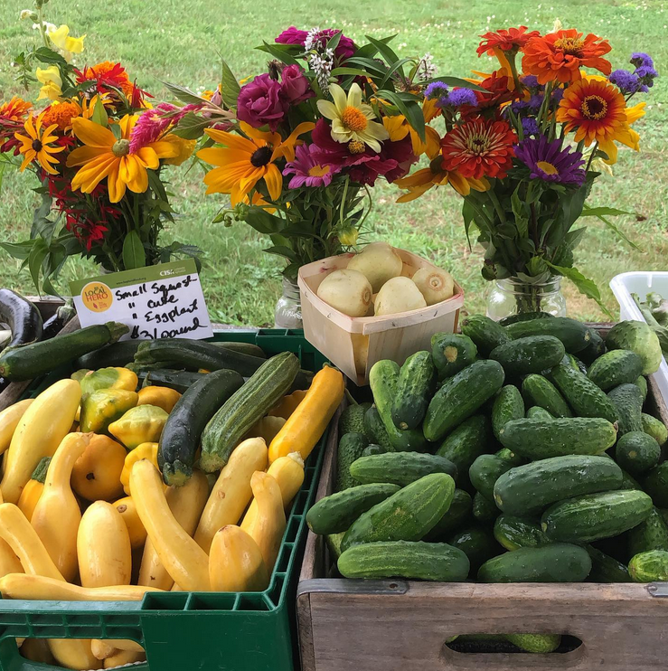

Our CSA is full for the 2025 season--sorry to have missed you!

If you were a member from last year please give Ben a call 413-548-6002.

If you're a new prospective member and would like to be on our January mailing list for the 2026 season please email Ben at <a href="mailto:benatintervale@gmail.com">benatintervale@gmail.com</a>

Intervale Farm CSA is a twenty week share program. This is our 24th year. We offer fresh produce, herbs and flowers on a weekly basis. Farm eggs are available at pick up. This season the CSA will be managed by Ben Geary who has worked with Rick and I for several years.

Our CSA consists of weekly farm pickups, June thru October. We offer two share sizes, full and medium.

* Full Share: $600.00 This option consists of 9-13 items each week. Ideal for a decent family to dine on all week or perhaps a couple/individual who enjoy freezing and canning some of the peak freshness for the winter.
* Medium Share: $450.00 This option consists of 7-10 items each week. A good amount for roommates or couples to share or a veggie enthusiastic individual.

Additionally with every share we’ll continue to offer Maureen's beautiful bouquets, but on a bi-weekly basis, with a bouquet of mixed herbs or a mix of hot peppers or maybe even a pint of neighboring farm's fruit on the off weeks.

### Recipes
If you're looking for some inspiration about how to cook the different veggies included in your CSA share, <a href="recipes">here are some options</a>.
