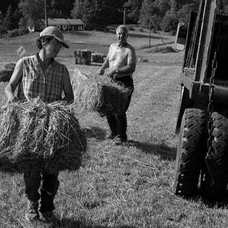
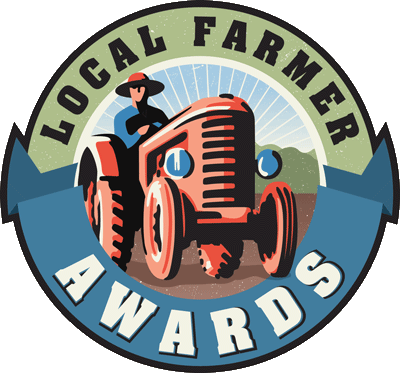

## History of Intervale Farm

Intervale Farm has been part of the Tracy Family since 1936 when it was purchased by Rick's grandfather, Dick Tracy.

It consists of 240 acres of fields, pastures and woodland. Janice and Bill, Rick's parents, ran the farm as a dairy until 1980.

Rick began growing vegetables in 1980 and continues this tradition today with his wife Maureen, and his parents. We grow 12 acres of produce and cut flowers, raise plants in our three greenhouses, tend a flock of sheep and sell eggs from a flock of laying hens. The plants and vegetables on the farm are grown without the use of chemical pesticides.

We began our CSA share program in 2002 and every year offer a variety of fruits, vegetables, and flowers for weekly pickup.

Our farm stand offers a place to pick up eggs, seasonal produce and flowers.

<h2>Autumn at Intervale Farm</h2>

A short montage of the Tracy Family farm in Westhampton, MA, being farmed by its third generation.

Video was produced by our nephew Ben Geary.

<iframe width="560" height="315" src="https://www.youtube.com/embed/NETZKRjFgfs?si=EXqjhAlaWIxvFLl-" title="YouTube video player" frameborder="0" allow="accelerometer; autoplay; clipboard-write; encrypted-media; gyroscope; picture-in-picture; web-share" referrerpolicy="strict-origin-when-cross-origin" allowfullscreen></iframe>

<h2>Memberships and Awards</h2>

    
    

