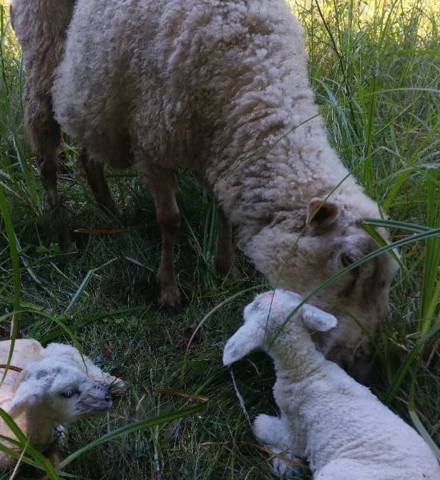
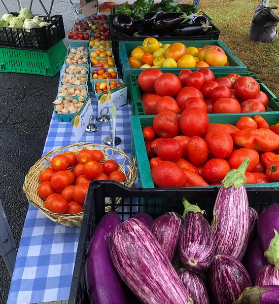

    
    
    

We are a small family farm located in Westhampton MA. Our vision is to provide healthy fresh produce and plants to the local community in a manner that is consistent with good land stewardship. We also strive to raise our livestock in a fashion that is both humane and productive and to sustain a way of life that supports our farm, family and community. We run a CSA, attend local farmers markets and sell from the farm.

Intervale Farm also does flowers for weddings, anniversaries and other special events. See the specialty flowers page for more details and contact information.
