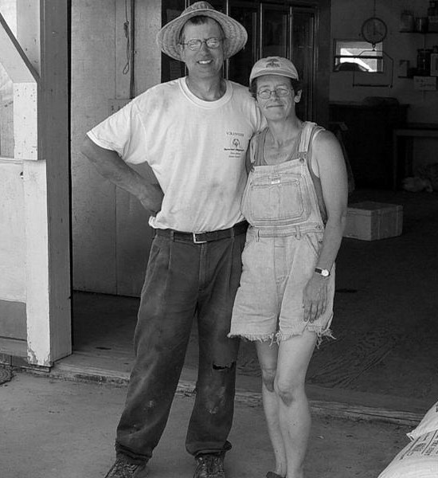

Intervale Farm is a small family farm located in Westhampton MA. Our vision is to provide healthy, fresh produce and plants to the local community in a manner that is consistent with good land stewardship. We also strive to raise our livestock in a fashion that is both humane and productive. We sustain a way of life that supports our farm, family and community. We run a CSA, attend local farmers markets and sell from the farm.

We also do flowers for weddings, anniversaries and other special events. See the specialty flowers page for more details.
